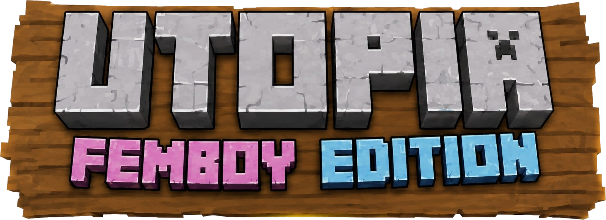

<p align="center">
  
</p>

# UtopiaMC Modpack

Utopia is a large Minecraft 1.20.1 Fabric modpack focused on technology,
exploration, quests, guided progression and queer-inclusive character systems.

## Repository status

This repository is being rebuilt from the active Utopia 3.0 development
workspace. The old repository contained only a few exported client state files
and did not represent the current pack. The maintained source code for Utopia
Core and Create Industrial Pressure is now part of the repository; pack
configuration and content generators will follow in separately reviewed phases.

Current technical baseline:

- Minecraft 1.20.1
- Fabric Loader 0.18.4
- Current verified release baseline: Utopia 3.0.0
- Repository source: Utopia Core `1.4.13+utopia.0.10.11`
- Repository source: Create: Industrial Pressure `0.1.0+1.20.1`, including
  the shared pipe-class and Create-compatible glass-pipe refactoring
- Active work areas: Utopia Core, Create Industrial Pressure, Guidebook,
  Heracles quests, FancyMenu, server pack, performance and stability

See [the current project status](docs/PROJECT_STATUS.md) and
[the migration plan](docs/REPOSITORY_MIGRATION.md) for details.

## Source projects

### Utopia Core

[`Utopia Core/`](Utopia%20Core/) is the pack's GPL-3.0 RPG core for Fabric
1.20.1. It is a maintained hard fork of LevelZ and provides character creation,
origins, independent gender and class selection, skills, unlock trees, commands,
networking and integrations used by the rest of Utopia.

Build with JDK 17:

```text
cd "Utopia Core"
./gradlew build
```

### Create: Industrial Pressure

[`Create Industrial Pressure/`](Create%20Industrial%20Pressure/) is the
Create addon (all rights reserved, source available) for high-pressure pipes, tiered pumps, larger fluid
networks and an endgame Netherite tier.

Build with JDK 17:

```text
cd "Create Industrial Pressure"
./gradlew build
```

Build output, caches and compiled JARs are intentionally excluded from Git.
Each source project contains its own license and technical documentation.

## Downloads

The version currently available through the public Modrinth listing is the
older **Utopia (Femboy Edition) 1.0.0** build. It is a legacy release and does
not represent the much newer Utopia 3 development state documented in this
repository.

Pack exports such as `.mrpack` files will be published as GitHub Release
assets. They are intentionally not committed to the source history.

## Reporting problems

Please use [GitHub Issues](https://github.com/TheSilentD3ath/UtopiaMC-Modpack/issues).
For crashes or performance problems, include the pack version, launcher,
operating system, Java version, reproduction steps and the relevant
`latest.log` or crash report. See [CONTRIBUTING.md](CONTRIBUTING.md).

## Public server

Repository activity and pack development do not by themselves confirm the
availability of a public server. Server availability will be announced
separately when there is a verified public endpoint.
